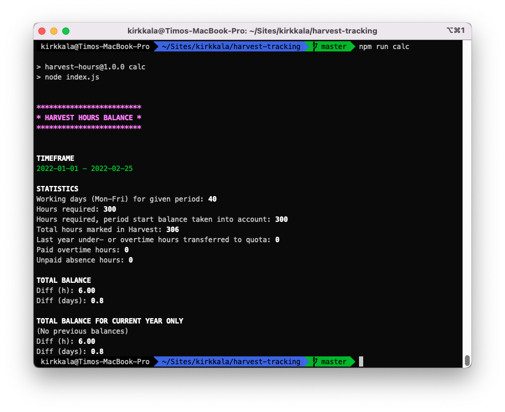

# Harvest tracking

A nodejs tool to track Harvest time for an overview of logged hours balance.

## Instructions

- Copy `.env.example` as `.env`
  - Modify as needed, comments in the file should explain
- Run the script: `npm run calc`
  - Without parameters the balance is checked from the first day of current year to current date
  - The dates can be adjusted with `from` and/or `to` arguments using format `YYYY-MM-DD`
    - e.g. `npm run calc -- --from=2022-02-01 --to=2022-02-28`

Script is tested with node `12` and `14`,
node `16` has problems with the [harvest](https://www.npmjs.com/package/harvest) (deprecated v1) lib.

## TODO
* Change [harvest](https://www.npmjs.com/package/harvest) to version 2
* Update all libraries